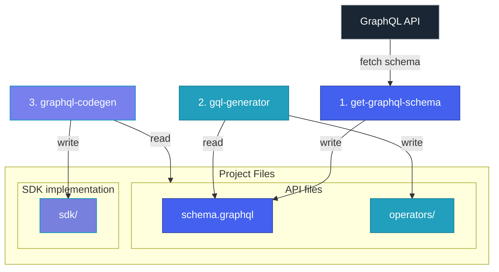

# GraphQL TypeScript SDK Generator

This tool generates a TypeScript SDK from a GraphQL API.


## Bird eye view




## Usage

Set the GraphQL API URL in the environment variable `GRAPHQL_API_URL`.
```bash
export GRAPHQL_API_URL=http://localhost:4000
```

Run the generate script (full process):
```bash
npm run generate
```

Run the generate script (step by step):
```bash
npm run get-graphql-schema
npm run gqlg
npm run codegen
```
