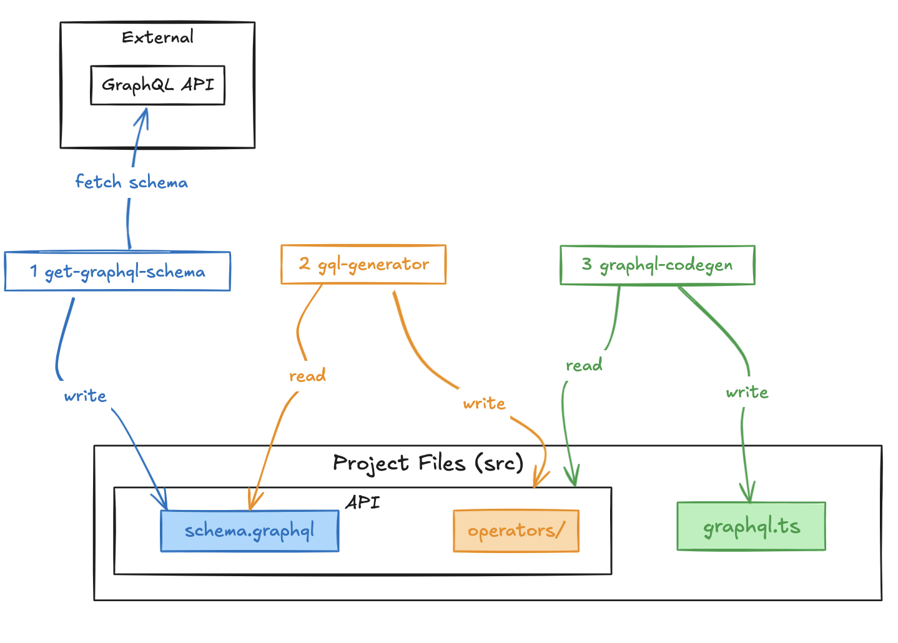

# GraphQL TypeScript SDK Generator

This tool generates a TypeScript SDK from a GraphQL API.



## Usage

Set the GraphQL API URL in the environment variable `GRAPHQL_API_URL`.
```bash
export GRAPHQL_API_URL=http://localhost:4000
```

Run the generate script (full process):
```bash
npm run generate
```

Run the generate script (step by step):
```bash
// 1. get/graphql-schema
npm run get-graphql-schema
// 2. gqlg-generaror
npm run gqlg
// 3. graphql-codegen
npm run codegen
```

## Example

For testing purposes, start the example server (see [example/gql-server](./example/gql-server/README.md)).
